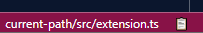

# Current Path

Atom style current file absolute/relative path in your Status Bar.

## Status Bar

## Commands

- `currentPath.absolutePath` - Copy file absolute path
- `currentPath.relativePath` - Copy file path relative to the working directory
- `currentPath.togglePathType` - Toggle shown path between absolute and relative
- `currentPath.fileName` - Copy file name

## Settings

- `currentPath.useAbsolutePath`: Toggle shown path between absolute and relative.
